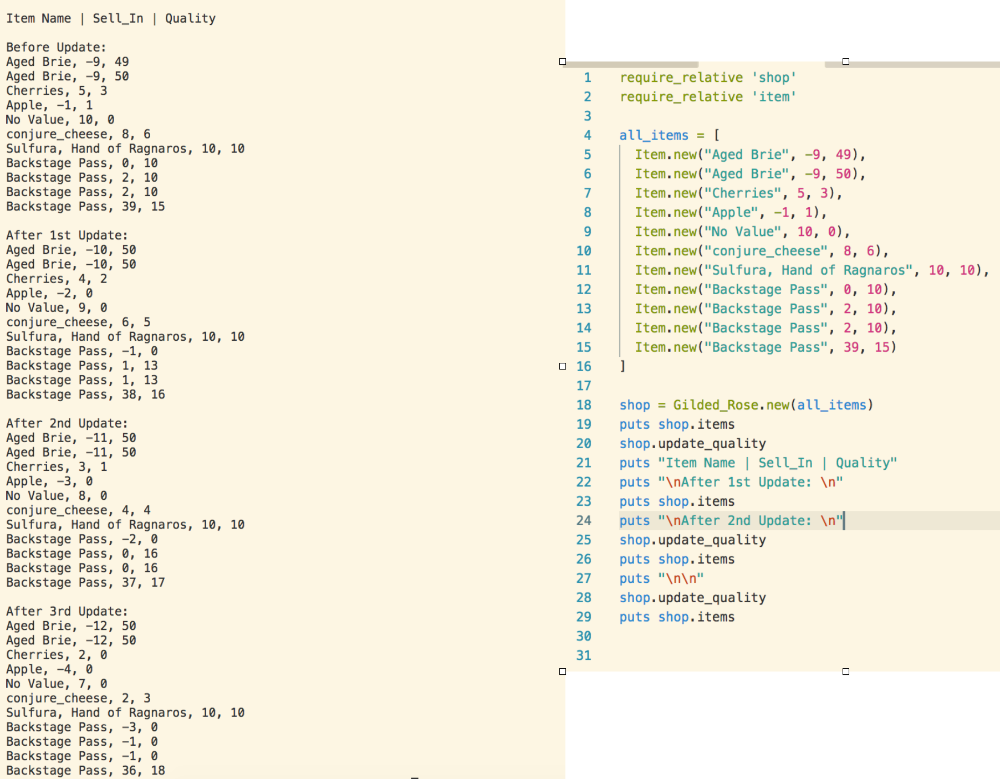

**Gilded Rose Tech Test**

 The Gilded Rose is a refactoring exercise where you have to improve the quality of legacy code and add a new feature. As it was a refactoring exercise, rather than starting the project from scratch I incremenentally added to the code base. The first thing I introduced was a separation of items into regular and irregular. 
 
 From there I refactored the code base so that the items were handled separately. To ensure this I created separate classes to handle regular items, and irregular items. Both classes rely on modules which contain code that all the classes need. Having modules reduces repetition and will enable me to add additional features to the codebase.

 I also introduced unit tests for each class, and an integration test to ensure changes made to items by a class reflected the desired state. The classes rely on passing objects by reference. When an item is passed to the item it recieves a pointer to the objects memory address. Any items changed by the class are thus updated throughout the application. I needed to ensure that I was keeping track of changes to item state, as they would persist throughout the application.

 The most challenging part of the application was debugging at the very end. If one update_quality method is called it updates the items as expected. However initially subsequent updates would change the state of quality and sell_in in strange ways. This was because initially I had my sorting of items included in the update quality method. Everytime the quality was updated the the sorted arrays received the exact same objects, creating unintended results. I was able to fix the bug by checking the item classes weren't changing sell_in multiple times and having the items sorted upon class initialization. 

 Through the challenge I learnt how to take advantage of calling by reference. I also am pleased with the modular code I've created, and my adherence to refactoring the codebase gradually. If I was to do this challenge again I would write integration tests before refactoring and ensure that every refactor passed unit and integration tests.

 **How To Run The App**

 Ensure you have ruby 2.5.0 installed in your computer and clone/download the repository. From there type in bundle install to install the necessary dependencies. Once this has been done you can either type in from the command line ruby lib/app.rb to run a sample application, or repuire the files into a REPL like irb to begin adding items to the gilded rose.

 To check the tests, run rspec and you will see 27 passing tests. These cover the individual classes and an integration test. To improve the testing I should have run an integration test for multiple update calls. 

 **Screenshot of Application**
 
 

